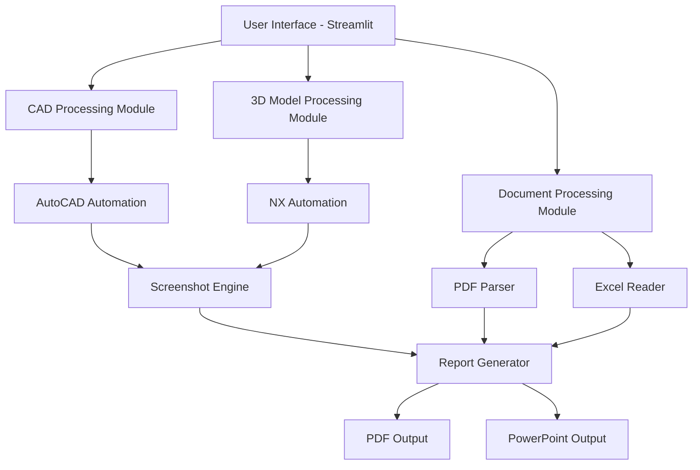

# 🏎️ Enhanced Tyre Design Proposal Report Automation

<div align="center">
  
  
  
  
</div>

## 📖 Overview

A sophisticated Python-based automation tool designed for **Apollo Tyres Ltd** that streamlines the generation of comprehensive tyre design proposal reports. The application seamlessly integrates data from multiple engineering sources including 2D CAD drawings, 3D models, technical specifications, and tabular data to produce professional-grade reports in both PDF and PowerPoint formats.

### 🎯 Key Value Proposition
- **Time Reduction**: Reduces report generation time from hours to minutes
- **Consistency**: Ensures standardized report formatting across all projects
- **Automation**: Eliminates manual screenshot capture and data compilation
- **Professional Output**: Generates publication-ready reports with proper branding

## ✨ Features

### 🔧 Core Functionality
| Feature | Description | Automation Level |
|---------|-------------|------------------|
| **📸 AutoCAD Integration** | Automatically opens DWG files, captures optimized screenshots, and closes AutoCAD | Fully Automated |
| **📐 NX 3D Model Capture** | Captures multiple standardized views (Top, Front, Right, Isometric) from 3D models | Semi-Automated |
| **📄 PDF Content Extraction** | Intelligently extracts and processes text from specification documents | Fully Automated |
| **📊 Excel Data Integration** | Imports, formats, and presents tabular specification data | Fully Automated |
| **📑 Multi-Format Reports** | Generates both PDF and PowerPoint reports with consistent branding | Fully Automated |

### 🎨 Advanced Capabilities
- **Smart Screenshot Cropping**: Automatically removes toolbars and UI elements to focus on design content
- **Multi-File Processing**: Handles multiple CAD files and 3D models in a single session
- **Professional Branding**: Integrates Apollo Tyres branding with customizable layouts
- **Responsive UI**: Intuitive tabbed interface with real-time progress feedback
- **Error Handling**: Robust error management with graceful fallbacks

## 🏗️ System Architecture



## 📋 Prerequisites

### Software Requirements
| Software | Version | Purpose | Installation Path |
|----------|---------|---------|-------------------|
| **Python** | 3.7+ | Core runtime | System PATH |
| **AutoCAD** | 2023+ | CAD file processing | `C:/Program Files/Autodesk/AutoCAD 2023/acad.exe` |
| **Siemens NX** | Latest | 3D model processing | `D:/abcde/NXBIN/ugraf.exe` |

### Python Dependencies
```txt
streamlit>=1.28.0
pandas>=1.5.0
pdfplumber>=4.0.0
opencv-python>=4.8.0
reportlab>=4.0.0
python-pptx>=0.6.21
pyautogui>=0.9.54
pygetwindow>=0.0.9
openpyxl>=3.1.0
Pillow>=10.0.0
```

## 🚀 Installation Guide

### 1. Repository Setup
```bash
# Clone the repository
git clone https://github.com/Shreyyy07/Design-proposal-report-automation-Project.git
cd Design-proposal-report-automation-Project

# Create virtual environment (recommended)
python -m venv tyre_report_env
source tyre_report_env/bin/activate  # On Windows: tyre_report_env\Scripts\activate
```

### 2. Dependency Installation
```bash
# Install required packages
pip install -r requirements.txt

# Verify installation
pip list | grep streamlit
```

### 3. Software Configuration
- **AutoCAD**: Ensure installation at default path or update path in `main.py` line 167
- **NX**: Verify installation path and update `nx_path` variable in `main.py` line 254
- **Apollo Logo**: Place `apollo_logo.png` in the project root directory (optional)

### 4. System Preparation
```bash
# Test AutoCAD path
"C:/Program Files/Autodesk/AutoCAD 2023/acad.exe" /?

# Test NX path  
"D:/abcde/NXBIN/ugraf.exe" -help
```

## 📖 Usage Instructions

### Starting the Application
```bash
streamlit run main.py
```
Access the application at `http://localhost:8501`

### Workflow Process

#### 🎯 Tab 1: CAD Drawing Capture
1. **Upload DWG Files**
   - Support for multiple files
   - Accepted formats: `.dwg`
   - File size limit: Based on system memory

2. **Automated Processing**
   ```
   ┌─ Upload Files ─┐
   │                │
   ▼                ▼
   AutoCAD Launch → File Load → Zoom Extents → Screenshot → AutoCAD Close
   ```

3. **Quality Assurance**
   - Automatic viewport detection
   - Optimized cropping parameters
   - Preview generation

#### 🎯 Tab 2: NX 3D Model Capture
1. **Launch NX Session**
   - Click "Open NX and Capture Views"
   - Manual file opening required

2. **View Capture Sequence**
   ```
   Top View → Front View → Right View → Isometric View
   ```

3. **Interactive Process**
   - 10-second countdown per view
   - Visual feedback signals
   - Progress tracking

4. **Multi-Model Support**
   - Add multiple 3D models
   - Organized model groups
   - Batch processing

#### 🎯 Tab 3: Report Generation
1. **Upload Supporting Documents**
   - PDF specification files
   - Excel data sheets
   - Multiple file support

2. **Report Configuration**
   - Content sequence: PDF → Excel → CAD → NX
   - Apollo Tyres branding
   - Professional formatting

3. **Output Generation**
   - PowerPoint presentation (.pptx)
   - PDF document (.pdf)
   - Instant download

## 🔧 Technical Implementation

### Core Modules

#### AutoCAD Integration
```python
def open_autocad_and_capture_screenshot(dwg_path):
    # Launches AutoCAD with specific DWG file
    # Executes zoom extents command
    # Captures optimized viewport screenshot
    # Handles graceful application closure
```

#### NX Automation
```python
def open_nx_and_capture_views_manual():
    # Manages NX application lifecycle
    # Coordinates multi-view capture sequence
    # Provides real-time user feedback
    # Ensures proper resource cleanup
```

#### Report Generation
```python
def generate_ppt(pdf_info, excel_df, cad_paths, nx_groups, output_path):
    # Creates professional PowerPoint presentation
    # Implements 2x2 grid layouts for images
    # Manages content pagination
    # Applies consistent branding
```

### Performance Optimizations
- **Asynchronous Processing**: Non-blocking UI during long operations
- **Memory Management**: Efficient image handling and cleanup
- **Error Recovery**: Automatic retry mechanisms for CAD operations
- **Resource Monitoring**: Process lifecycle management

## 📁 Project Structure

```
Design-proposal-report-automation-Project/
├── main.py                     # Main application file
├── requirements.txt            # Python dependencies
├── README.md                  # Project documentation
├── apollo_logo.png            # Company branding (optional)
├── .gitignore                 # Git ignore rules
└── docs/                      # Additional documentation
    ├── user_guide.md          # Detailed user guide
    ├── troubleshooting.md     # Common issues and solutions
    └── api_reference.md       # Code documentation
```

## ⚙️ Configuration Options

### Customizable Parameters
```python
# AutoCAD Configuration
AUTOCAD_PATH = "C:/Program Files/Autodesk/AutoCAD 2023/acad.exe"
AUTOCAD_LOAD_TIME = 15  # seconds

# NX Configuration  
NX_PATH = r"D:\abcde\NXBIN\ugraf.exe"
NX_LOAD_TIME = 20  # seconds

# Screenshot Settings
CROP_LEFT_RATIO = 0.15
CROP_TOP_RATIO = 0.20
CROP_RIGHT_RATIO = 0.85
CROP_BOTTOM_RATIO = 0.75
```

### Report Customization
- **Logo Integration**: Replace `apollo_logo.png` with custom branding
- **Color Schemes**: Modify RGB values in PowerPoint generation
- **Layout Templates**: Adjust slide layouts in `create_*_slides()` functions

## 🔒 Security Considerations

- **File Validation**: Input sanitization for uploaded files
- **Process Isolation**: Sandboxed CAD application execution
- **Temporary File Management**: Automatic cleanup of sensitive data
- **Access Control**: Session-based data isolation

## 🐛 Troubleshooting

### Common Issues and Solutions

#### AutoCAD Launch Failures
```bash
# Verify AutoCAD installation
dir "C:\Program Files\Autodesk\AutoCAD 2023\"

# Check system resources
tasklist | findstr acad

# Solution: Update path or increase load time
```

#### NX Connection Issues
```bash
# Test NX executable
"D:\abcde\NXBIN\ugraf.exe" -version

# Check file permissions
icacls "D:\abcde\NXBIN\ugraf.exe"
```

#### Screenshot Quality Problems
- **Symptom**: Blurry or incomplete screenshots
- **Cause**: Timing issues or resolution conflicts
- **Solution**: Adjust `time.sleep()` values based on system performance

#### Memory Issues
- **Symptom**: Application crashes during processing
- **Cause**: Large file processing or memory leaks
- **Solution**: Process files in smaller batches, restart application

### Performance Tuning

#### System Requirements
| Component | Minimum | Recommended |
|-----------|---------|-------------|
| **RAM** | 8 GB | 16 GB+ |
| **CPU** | Dual-core | Quad-core+ |
| **Storage** | 10 GB free | 50 GB+ free |
| **Display** | 1920x1080 | 2560x1440+ |

#### Optimization Tips
- Close unnecessary applications during automation
- Use SSD storage for faster file access
- Ensure stable network connection for cloud files
- Regular system restarts to clear memory

## 🤝 Contributing

### Development Setup
```bash
# Fork and clone repository
git clone https://github.com/yourusername/Design-proposal-report-automation-Project.git

# Create feature branch
git checkout -b feature/your-feature-name

# Install development dependencies
pip install -r requirements-dev.txt

# Run tests
python -m pytest tests/
```

### Code Standards
- **PEP 8**: Python style guidelines
- **Type Hints**: Use for function parameters and returns
- **Documentation**: Comprehensive docstrings for all functions
- **Testing**: Unit tests for critical functionality

## 📄 License

This project is licensed under the MIT License - see the [LICENSE](LICENSE) file for details.

## 👥 Support & Contact

### Project Maintainer
- **Developer**: Shrey
- **Contributors**: Rushil & Tanushka
- **Organization**: Apollo Tyres Global R&D Ltd
- **GitHub**: [@Shreyyy07](https://github.com/Shreyyy07)

### Getting Help
1. **GitHub Issues**: Report bugs and request features
2. **Documentation**: Check the `docs/` directory
3. **Community**: Join discussions in GitHub Discussions

### Acknowledgments
-Apollo Tyres Global R&D Ltd for project sponsorship
- Autodesk and Siemens for software integration capabilities
- Open-source community for foundational libraries

---

<div align="center">
  <p><strong>Built with ❤️ for Apollo Tyres Global R&D Ltd</strong></p>
  <p>Automating Engineering Excellence</p>
</div>
